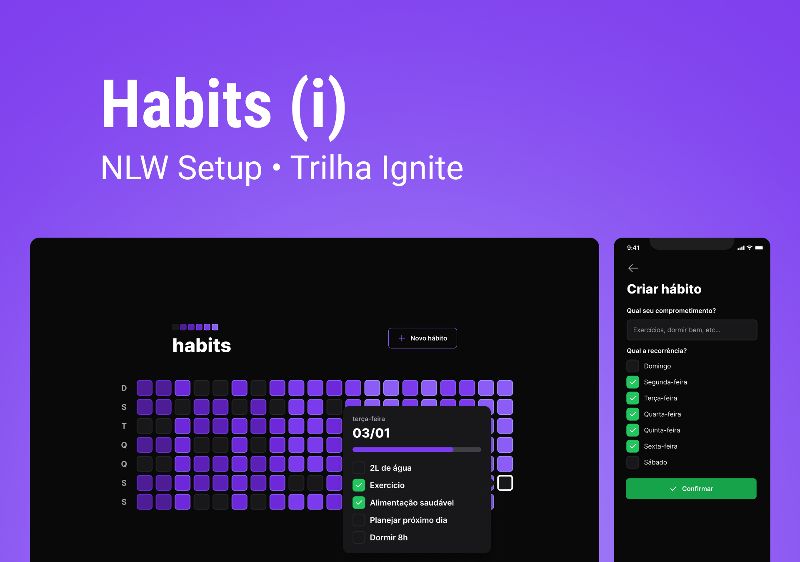

<h4 align="center">
 🚀 NLW Setup 🚀
</h4>

<p align="center">
  <a href="#--sobre-o-projeto">Sobre</a> •
  <a href="#--layout">Layout</a> •
  <a href="#--tecnologias">Tecnologias</a> 
</p>

<br/>




## [](https://github.com/frantecbh/NLW-Setup-ignite#--sobre-o-projeto) 💻 Sobre o projeto

Projeto desenvolvido durante o evento NLW Setup da [Rocketseat](https://www.rocketseat.com.br/), habit tracker, uma ferramenta de acompanhamento de hábitos para o usuário colocar em prática suas resoluções e metas, ou seja, registrar ações e acompanhar a evolução dos novos hábitos que deseja colocar na sua rotina, projeto fullstack desenvolvido desde o backend, até a sua versão web e mobile.

---

#### 🧭 Rodando a aplicação
```bash
# Clone este repositório

$ git clone https://github.com/frantecbh/NLW-Setup-ignite

```

Web
```bash
# Instale as dependências
$ npm install ou yarn

# Execute a aplicação
$ npm run dev ou yarn dev
```

Mobile
```bash
# Instale as dependências
$ npm install ou yarn

# Execute a aplicação
$ npx expo start
```

Server
```bash
# Instale as dependências
$ npm install ou yarn

# Execute a aplicação
$ npm run dev ou yarn dev
```


---

## [](https://github.com/frantecbh/NLW-Setup-ignite#--layout) 🔖 Layout

Você pode visualizar o layout do projeto através [desse link](https://www.figma.com/community/file/1195326661124171197). É necessário ter conta no [Figma](http://figma.com/) para acessá-lo.

---

## [](https://github.com/frantecbh/NLW-Setup-ignite#--tecnologias) 🛠 Tecnologias

As seguintes ferramentas foram usadas na construção do projeto:

- Vite
- Tailwind
- React
- React Native
- Expo
- NodeJS
- Fastify
- Prisma
- Typescript
